```
 _          _    _    ____                  _       
| |    ___ | | _(_)  / ___|___  _   _  ___ | |_ ___ 
| |   / _ \| |/ / | | |   / _ \| | | |/ _ \| __/ _ \
| |__| (_) |   <| | | |__| (_) | |_| | (_) | ||  __/
|_____\___/|_|\_\_|  \____\___/ \__, |\___/ \__\___|
                                |___/               
```

I build data infrastructure during the day and take things apart at night. 20+ years of making opaque systems legible; identity resolution, geospatial indexing, privacy engineering, reverse engineering, security research. Currently Principal Engineer at [El Toro](https://www.eltoro.com).
 
[](https://www.youtube.com/watch?v=wzyuioto4y8)
[](#)

### What I'm building
 
| Project | What it is |
|---------|-----------|
| **[x428](https://x428.org)** | Open protocol for machine-readable precondition attestation (HTTP/MCP) |
| **[trinops](https://trino.ps/)** | Trino monitoring TUI; pip-installable |
| **[bentopdf-sh](https://bentopdf.sh/)** | PDF toolkit for your command line - and for skills |
| **[stare.pub](https://stare.pub/)** | Free, open U.S. case law lookup |
 
### Domains
 
```
ad tech · identity resolution · privacy engineering · geoinformatics
reverse engineering · SDR · security research · protocol design · jurimetrics
```
 
---
 




---
